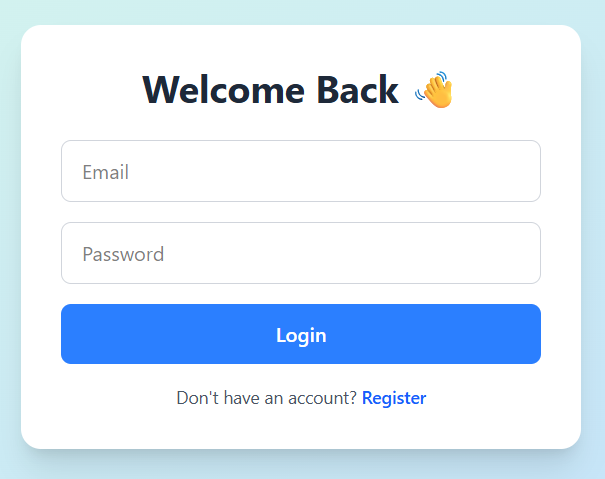
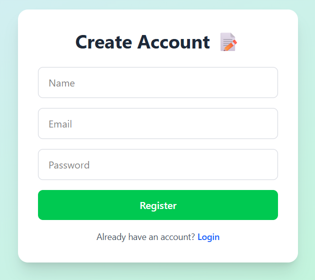
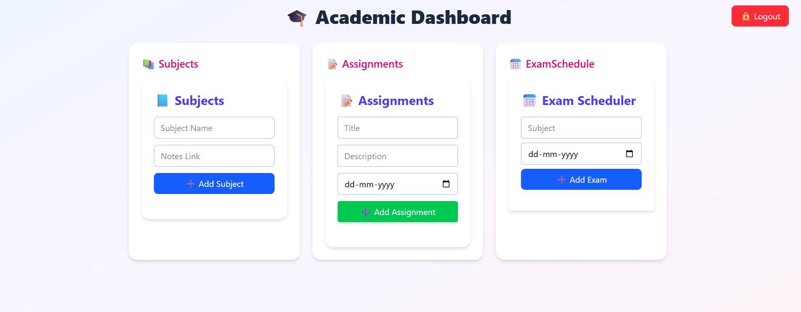
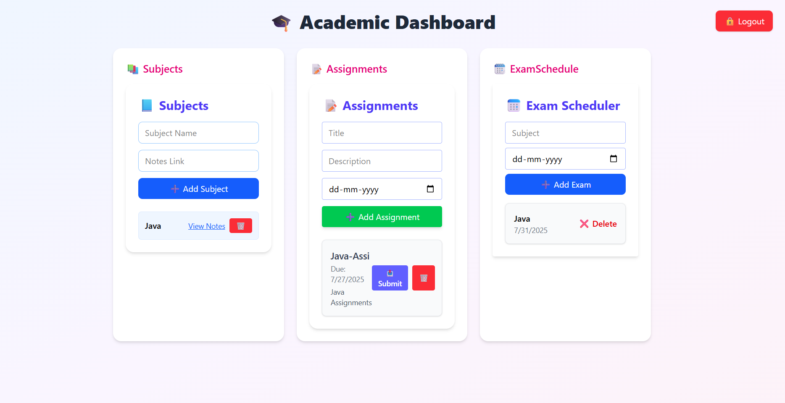

# 🎓 Academic Companion

**Academic Companion** is a full-stack MERN (MongoDB, Express.js, React.js, Node.js) application built to serve as a centralized academic assistant for students. From managing subjects to tracking assignments and scheduling exams — this platform provides an all-in-one solution to simplify student academic life.

---

## 📋 Description

Many students struggle to stay on top of assignments, exam dates, and personal academic progress. Academic Companion aims to solve this problem by offering:

- 🧭 A user-friendly dashboard  
- 🧩 Intuitive components for managing subjects, exams, and tasks  
- 🔐 Secure authentication  

🎯 This project is ideal for academic institutions or individual students seeking a productivity tool tailored for education.

---

## 🚀 Features

### 📚 Subject Management
- ➕ Add new subjects with names and codes
- 🧾 View and manage your current subjects

### 📝 Assignment Tracker
- 📅 Add assignments with deadlines
- 👀 View pending or submitted assignments

### 🧪 Exam Scheduler
- 📆 Schedule exams by subject and date
- ⏱️ See a timeline of upcoming exams

### 🔐 Authentication
- 🔑 Secure authentication system with OTP

---

## 🛠️ Tech Stack

### Frontend – built with ⚛️ React
- ⚛️ **React.js** – Component-based UI  
- 📡 **Axios** – API request handling  
- 🧭 **React Router** – Navigation  
- 🎨 **Tailwind CSS** – Utility-first responsive design  
- ⚡ **Vite** – Lightning-fast dev environment  

### Backend – built with 🚀 Node.js + Express
- 🌐 **Express.js** – Routing & Middleware  
- 🍃 **MongoDB** – NoSQL Database  
- 🧩 **Mongoose** – ODM for MongoDB  
- 🔐 **dotenv** – Secure environment variables  

---

## 👀 Preview






---

## 🔗 Live Preview

🚧 *Live demo link coming soon...*

---

## 🧑‍💻 How to Clone & Run Locally :---

 1. 📥 **Clone the Repository**
```bash
git clone https://github.com/your-username/academic-companion.git

cd academic-companion
```

2. 📁 **Navigate to the Backend Directory**
```bash
  cd backend
```

3. 🧱 **Install Backend Dependencies**
```bash
  npm install
```

4. ⚙️ **Configure Environment Variables**

   Create a .env file in the backend folder and add:
```bash
  MONGO_URI=your_mongodb_connection_string
  JWT_SECRET=your_jwt_secret_key
```

5. 🚀 **Start the Backend Server**
```bash
  node app.js
```

6. 🌐 **Navigate to the Frontend Directory**
```bash
  cd frontend
```
7. 🚀 **Install Frontend Dependencies**
```bash
  npm install
```
8. 🚀 **Start the Frontend Dev Server**
```bash
  npm run dev
```
9. 🖥️ **Open in Browser**
 http://localhost:5173

---

## 🏅 Badges

Add badges from somewhere like: [shields.io](https://shields.io/)

[](https://choosealicense.com/licenses/mit/)

[](https://opensource.org/licenses/)

[](http://www.gnu.org/licenses/agpl-3.0)

---

## 📄 License

This project is licensed under the [MIT License](LICENSE).